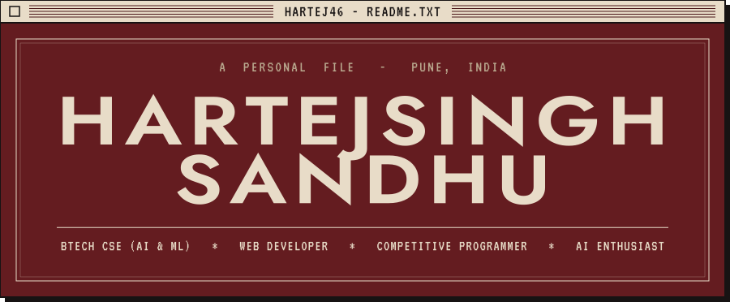
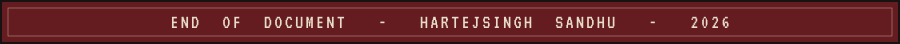

<div align="center">



</div>

<br/>


```text
 NAME ........ Hartejsingh Sandhu  (hartej46)
 STUDYING .... BTech CSE (AI & ML), Newton School of Technology, Pune
 ROLES ....... Web Developer / Competitive Programmer / AI Enthusiast
 INTERESTS ... Full-Stack Web Development, DSA, Machine Learning
```

```text
 Passionate about technology, problem-solving, and building
 impactful projects. Always curious to learn, experiment, and grow.

 FUN FACT:  I love tech, and tech loves me back.
```

<br/>


```text
 [>] Strengthening DSA, ML & Competitive Programming
 [>] Working through a structured ML / computer vision track
 [>] Building real-world projects using modern web technologies
```

<br/>


```text
 LANGUAGES ... C, C++, Python, JavaScript, TypeScript
 WEB ......... HTML, CSS, Tailwind, React, Node.js, Express, MongoDB
 AI / ML ..... PyTorch, OpenCV
 TOOLS ....... Git, GitHub, VS Code, Cursor, Linux, Postman
```

<br/>


| PROJECT | SOURCE | LIVE |
|:--|:--|:--|
| **HireAI** (resume screening platform) | [`resume-screening-platform`](https://github.com/hartej46/resume-screening-platform) | [`open`](https://resume-screening-platform.vercel.app) |
| **NST Helper** | [`nstHelper`](https://github.com/hartej46/nstHelper) | [`open`](https://nsthelper.vercel.app) |
| **URL Shortener** | [`urlShortner`](https://github.com/hartej46/urlShortner) | [`open`](https://urlshortnerhartej.vercel.app) |
| **Tokenizer** | [`tokenizer`](https://github.com/hartej46/tokenizer) | n/a |
| **Distil-BERT** | [`Distil-BERT`](https://github.com/hartej46/Distil-BERT) | n/a |

<br/>


```text
 EXP. 2029     Newton School of Technology, Pune
               BTech in Computer Science (AI & ML)

 PRESENT       Developer Club
               Committee Member
```

<!--

Add achievements here when you are ready (also needs an achievements.svg header).
-->

<br/>


<div align="center">


</div>

<br/>


```text
 Open to collaborations, projects, internships and tech discussions.

 EMAIL ...... reach.hartej@gmail.com
 GITHUB ..... github.com/hartej46
```

[`Send an email`](mailto:reach.hartej@gmail.com) &nbsp;/&nbsp; [`View GitHub`](https://github.com/hartej46)

```text
 "Any sufficiently advanced technology is indistinguishable from magic."
                                                  - Arthur C. Clarke
```

<br/>


