

<picture>
  <source media="(prefers-color-scheme: dark)" srcset="assets/hero-dark.svg">
  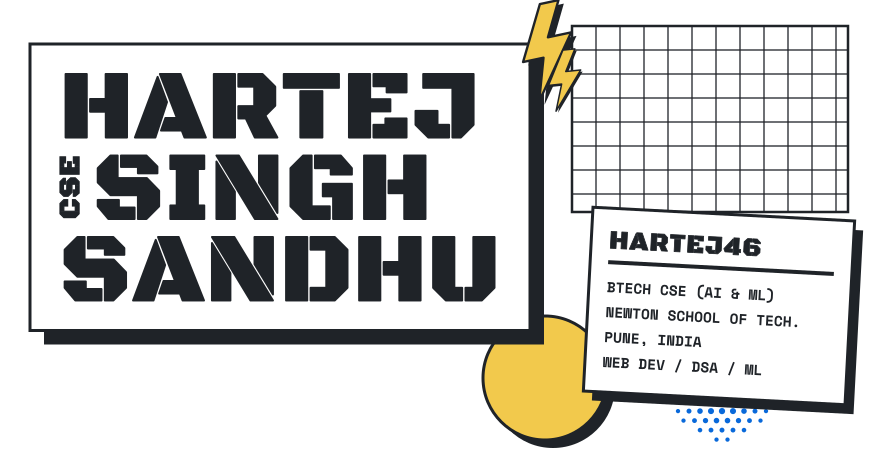
</picture>

<picture>
  <source media="(prefers-color-scheme: dark)" srcset="assets/h-about-dark.svg">
  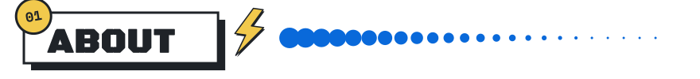
</picture>

<picture>
  <source media="(prefers-color-scheme: dark)" srcset="assets/aboutcard-dark.svg">
  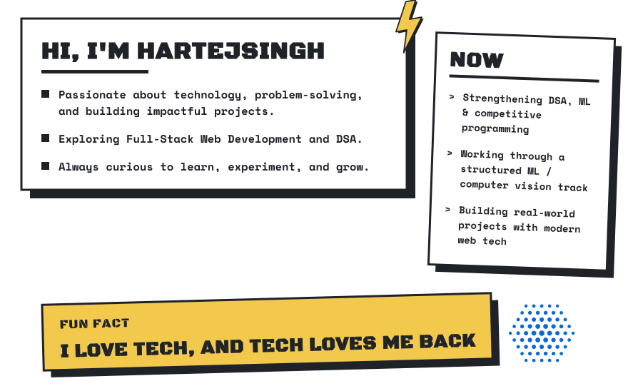
</picture>

 

<picture>
  <source media="(prefers-color-scheme: dark)" srcset="assets/h-stack-dark.svg">
  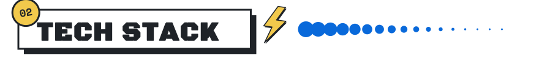
</picture>

<picture>
  <source media="(prefers-color-scheme: dark)" srcset="assets/stack-dark.svg">
  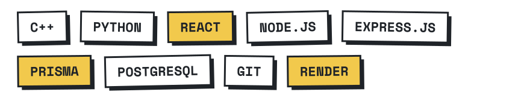
</picture>

 

<picture>
  <source media="(prefers-color-scheme: dark)" srcset="assets/h-projects-dark.svg">
  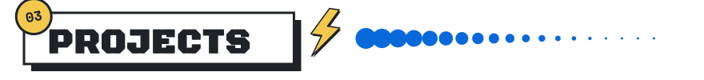
</picture>

<table>
<tr>
<td width="50%"><a href="https://github.com/hartej46/nstHelper"><picture><source media="(prefers-color-scheme: dark)" srcset="assets/card-nst-dark.svg">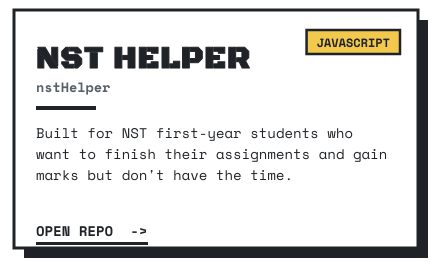</picture></a></td>
<td width="50%"><a href="https://github.com/hartej46/resume-screening-platform"><picture><source media="(prefers-color-scheme: dark)" srcset="assets/card-hireai-dark.svg">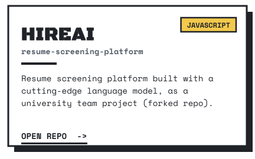</picture></a></td>
</tr>
<tr>
<td width="50%"><a href="https://github.com/hartej46/Tokenizer"><picture><source media="(prefers-color-scheme: dark)" srcset="assets/card-tokenizer-dark.svg">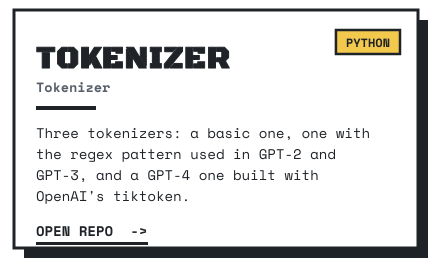</picture></a></td>
<td width="50%"><a href="https://github.com/hartej46/urlShortner"><picture><source media="(prefers-color-scheme: dark)" srcset="assets/card-url-dark.svg">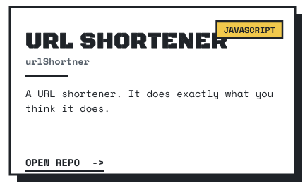</picture></a></td>
</tr>
<tr>
<td width="50%"><a href="https://github.com/hartej46/sticky-notes"><picture><source media="(prefers-color-scheme: dark)" srcset="assets/card-sticky-dark.svg">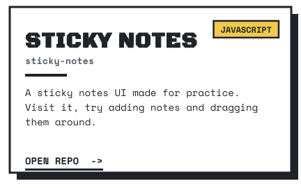</picture></a></td>
<td width="50%"><a href="https://github.com/hartej46?tab=repositories"><picture><source media="(prefers-color-scheme: dark)" srcset="assets/card-more-dark.svg">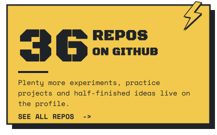</picture></a></td>
</tr>
</table>

**LIVE:** [NST Helper](https://nsthelper.vercel.app) &nbsp;/&nbsp; [HireAI](https://resume-screening-platform.vercel.app) &nbsp;/&nbsp; [URL Shortener](https://urlshortnerhartej.vercel.app) &nbsp;&nbsp;|&nbsp;&nbsp; **ALSO:** [Distil-BERT](https://github.com/hartej46/Distil-BERT)

 

<picture>
  <source media="(prefers-color-scheme: dark)" srcset="assets/h-achievements-dark.svg">
  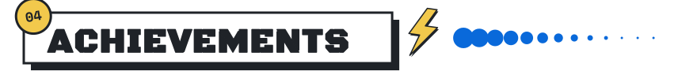
</picture>

<a href="https://github.com/hartej46?tab=achievements"><picture>
  <source media="(prefers-color-scheme: dark)" srcset="assets/ach-dark.svg">
  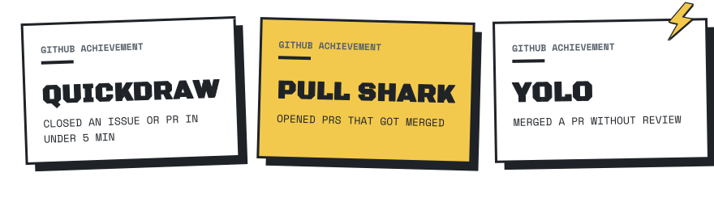
</picture></a>

 

<picture>
  <source media="(prefers-color-scheme: dark)" srcset="assets/h-stats-dark.svg">
  
</picture>

<picture>
  <source media="(prefers-color-scheme: dark)" srcset="https://github-readme-stats.vercel.app/api?username=hartej46&show_icons=true&hide_border=false&border_color=30363d&bg_color=0d1117&title_color=58a6ff&icon_color=e3b341&text_color=e6edf3&ring_color=58a6ff&card_width=420">
  
</picture>
<picture>
  <source media="(prefers-color-scheme: dark)" srcset="https://github-readme-stats.vercel.app/api/top-langs/?username=hartej46&layout=compact&hide_border=false&border_color=30363d&bg_color=0d1117&title_color=58a6ff&text_color=e6edf3&langs_count=8&card_width=320">
  
</picture>

  

<picture>
  <source media="(prefers-color-scheme: dark)" srcset="https://streak-stats.demolab.com?user=hartej46&background=0D1117&border=30363D&ring=58A6FF&fire=E3B341&currStreakNum=E6EDF3&sideNums=E6EDF3&currStreakLabel=58A6FF&sideLabels=E6EDF3&dates=8B949E">
  
</picture>

 

<picture>
  <source media="(prefers-color-scheme: dark)" srcset="assets/h-contact-dark.svg">
  
</picture>

**Open to collaborations, projects, internships, and tech discussions.**

 

<a href="https://hartej.vercel.app"><picture><source media="(prefers-color-scheme: dark)" srcset="assets/b-website-dark.svg"></picture></a>
<a href="https://linkedin.com/in/hartej46"><picture><source media="(prefers-color-scheme: dark)" srcset="assets/b-linkedin-dark.svg"></picture></a>
<a href="https://codeforces.com/profile/hartej46"><picture><source media="(prefers-color-scheme: dark)" srcset="assets/b-codeforces-dark.svg"></picture></a>
<a href="https://x.com/HartejsinghS"><picture><source media="(prefers-color-scheme: dark)" srcset="assets/b-x-dark.svg"></picture></a>
<a href="https://bsky.app/profile/hartej46.bsky.social"><picture><source media="(prefers-color-scheme: dark)" srcset="assets/b-bluesky-dark.svg"></picture></a>
<a href="https://instagram.com/hartej_46"><picture><source media="(prefers-color-scheme: dark)" srcset="assets/b-instagram-dark.svg"></picture></a>
<a href="mailto:reach.hartej@gmail.com"><picture><source media="(prefers-color-scheme: dark)" srcset="assets/b-email-dark.svg"></picture></a>

 

`reach.hartej@gmail.com`

 

<picture>
  <source media="(prefers-color-scheme: dark)" srcset="assets/footer-dark.svg">
  
</picture>
